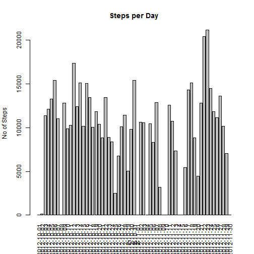
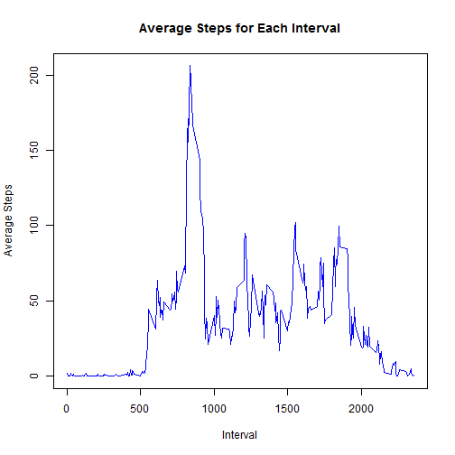
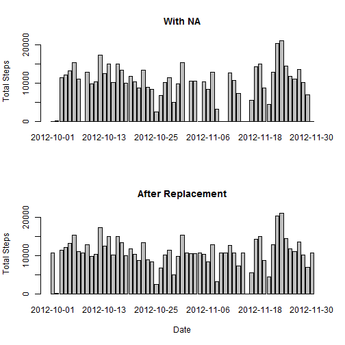
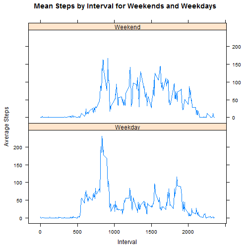

This is a markdown document for the first perr assignment of the Reproducible Research Course


Data is first unzipped and read into a dataframe 'activity', with a datetime field added 'date1'
  

```r
unzip("activity.zip")
activity<-read.csv("activity.csv")
activity$date1<-as.Date(activity$date,"%Y-%m-%d")
```

The variables included in this dataset are:

1 steps: Number of steps taking in a 5-minute interval (missing values are coded as NA)
2 date: The date on which the measurement was taken in YYYY-MM-DD format
3 interval: Identifier for the 5-minute interval in which measurement was taken

The dataset is stored in a comma-separated-value (CSV) file and there are a total of 17,568 observations in this dataset.


##Section 1: What is mean total number of steps taken per day?
For this part of the assignment, you can ignore the missing values in the dataset.
Make a histogram of the total number of steps taken each day
Calculate and report the mean and median total number of steps taken per day


```r
act_sum<-with(activity,tapply(steps, date, sum, na.rm=TRUE))
barplot(act_sum, xlab="Date", ylab="No of Steps", main = "Steps per Day", las=3)
```

 

Mean of total steps per day: 

```r
mean(act_sum)
```

```
## [1] 9354
```

Median of total steps per day:  

```r
median(act_sum)
```

```
## [1] 10395
```

##Section 2: What is the average daily activity pattern?
1 Make a time series plot (i.e. type = "l") of the 5-minute interval (x-axis) and the average number of steps taken, averaged across all days (y-axis)


```r
act_mean<-with(activity,aggregate(steps, list(interval), mean,na.rm=TRUE , na.action = null))
names(act_mean) <- c("interval", "step_mean")

with(act_mean,plot(interval, step_mean,pch=4, col="blue", type="l", xlab="Interval", ylab= "Average Steps", main = "Average Steps for Each Interval"))
```

 


2 Which 5-minute interval, on average across all the days in the dataset, contains the maximum number of steps?


```r
subset(act_mean, step_mean==max(act_mean$step_mean, na.rm=TRUE))
```

```
##     interval step_mean
## 104      835     206.2
```

##Section 3: Inputing missing values

1 Calculate and report the total number of missing values in the dataset (i.e. the total number of rows with NAs)

The total number of missing Steps data items is:

```r
dim(subset(activity, is.na(steps)))[1]
```

```
## [1] 2304
```

2 Devise a strategy for filling in all of the missing values in the dataset. 

The missing data items will be replaced with the avergage value over the interval that the items are related to.

3  Create a new dataset that is equal to the original dataset but with the missing data filled in.


```r
act_mean_interval<-with(activity,aggregate(steps, list(interval), mean,na.rm=TRUE , na.action = null))
names(act_mean_interval) <- c("interval", "step_mean")

act_replaced<-merge(activity,act_mean_interval, by="interval")  

act_replaced$steps[is.na(act_replaced$steps)]<-act_replaced$step_mean[is.na(act_replaced$steps)]
act_replaced$steps[is.na(act_replaced$steps)]<-0
```


4 Make a histogram of the total number of steps taken each day.


```r
act_sum<-with(activity,tapply(steps, date, sum, na.rm=TRUE))
act_replaced_sum<-with(act_replaced,tapply(steps, date, sum, na.rm=TRUE))

par(mfrow = c(2,1))

barplot(act_sum, main="With NA", ylab="Total Steps")
barplot(act_replaced_sum, main="After Replacement", ylab="Total Steps", xlab="Date")
```

 

5 Calculate and report the mean and median total number of steps taken per day. Do these values differ from the estimates from the first part of the assignment? What is the impact of imputing missing data on the estimates of the total daily number of steps?

Both Mean And Median Increase:

Mean Before replacement: 

```r
mean(act_sum)
```

```
## [1] 9354
```

Mean After replacement: 

```r
mean(act_replaced_sum)
```

```
## [1] 10766
```

Median Before replacement: 

```r
median(act_sum)
```

```
## [1] 10395
```

Median After replacement: 

```r
median(act_replaced_sum)
```

```
## [1] 10766
```


##Section 4: Are there differences in activity patterns between weekdays and weekends?

1 Create a new factor variable in the dataset with two levels - "weekday" and "weekend" indicating whether a given date is a weekday or weekend day.


```r
act_replaced$day <- weekdays(act_replaced$date1)
act_replaced$daytype <- "Weekday"
act_replaced$daytype[act_replaced$day=="Sunday"] <- "Weekend"
act_replaced$daytype[act_replaced$day=="Saturday"] <- "Weekend"
act_replaced$daytype<-factor(act_replaced$daytype)
```

2 Make a panel plot containing a time series plot (i.e. type = "l") of the 5-minute interval (x-axis) and the average number of steps taken, averaged across all weekday days or weekend days (y-axis). The plot should look something like the following, which was creating using simulated data:
    

```r
act_weekend_mean<-with(subset(act_replaced,daytype=="Weekend"), aggregate(steps, list(interval), mean,na.rm=TRUE , na.action = null))
names(act_weekend_mean) <- c("interval", "step_mean")

act_weekday_mean<-with(subset(act_replaced,daytype=="Weekday"), aggregate(steps, list(interval), mean,na.rm=TRUE , na.action = null))
names(act_weekday_mean) <- c("interval", "step_mean")

act_weekend_mean$daytype <-"Weekend"
act_weekday_mean$daytype <-"Weekday"

act_final_mean<-rbind(act_weekend_mean,act_weekday_mean)

library(lattice) 
attach(act_final_mean)
```

```
## The following objects are masked from act_final_mean (position 3):
## 
##     daytype, interval, step_mean
## The following objects are masked from act_final_mean (position 5):
## 
##     daytype, interval, step_mean
```

```r
xyplot(step_mean~interval|daytype, ylab="Average Steps", xlab="Interval",
       main="Mean Steps by Interval for Weekends and Weekdays", layout=c(1,2), type="l")
```

 
